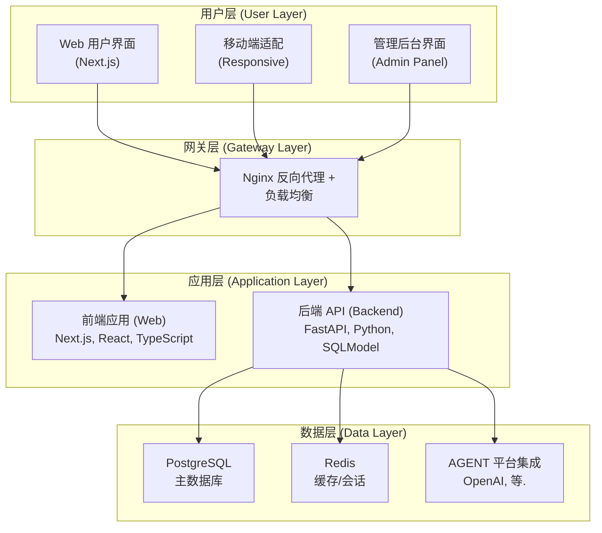

# BAIT: Build AI Template

**Build AI Template** 是一个面向开发者的开源 AI 应用模板，采用 `FastAPI` + `Next.js` 技术栈，集成主流 AI 平台，内置 **用户管理**、**智能对话**、**会员支付** 与 **可视化管理后台**，助力高效搭建现代化 AI 产品。

[English README](README_EN.md)

> [!IMPORTANT]
> 🚀 **快速开始**：点击页面右上角的 [Use this template](https://github.com/open-v2ai/build-ai-template/generate) 按钮创建您的新项目！

[在线演示 🔗](https://bait.v2ai.org)

<picture>
  <source media="(prefers-color-scheme: dark)" srcset="https://raw.githubusercontent.com/open-v2ai/build-ai-template/refs/heads/main/.github/images/screenshot_v0_1_dark_web.png">
  <source media="(prefers-color-scheme: light)" srcset="https://raw.githubusercontent.com/open-v2ai/build-ai-template/refs/heads/main/.github/images/screenshot_v0_1_light_web.png">
  
</picture>

<picture>
  <source media="(prefers-color-scheme: dark)" srcset="https://raw.githubusercontent.com/open-v2ai/build-ai-template/refs/heads/main/.github/images/screenshot_v0_1_dark_admin.png">
  <source media="(prefers-color-scheme: light)" srcset="https://raw.githubusercontent.com/open-v2ai/build-ai-template/refs/heads/main/.github/images/screenshot_v0_1_light_admin.png">
  
</picture>

[在线文档 🔗](https://bait-docs.v2ai.org)

<picture>
  <source media="(prefers-color-scheme: dark)" srcset="https://raw.githubusercontent.com/open-v2ai/build-ai-template/refs/heads/main/.github/images/screenshot_v0_1_dark_docs.png">
  <source media="(prefers-color-scheme: light)" srcset="https://raw.githubusercontent.com/open-v2ai/build-ai-template/refs/heads/main/.github/images/screenshot_v0_1_light_docs.png">
  
</picture>

## 🎯 项目特色

- **🚀 开箱即用**：完整的 AI 应用解决方案，无需从零开始
- **🔧 高度可定制**：模块化设计，轻松扩展和定制功能
- **🌍 多平台支持**：集成 OpenAI、Dify、FastGPT、Coze 等主流 AI 平台
- **📱 现代化界面**：基于 Shadcn UI 的美观响应式设计
- **🔒 企业级安全**：完善的用户认证和权限管理
- **📊 数据洞察**：详细的使用统计和管理后台

## 核心特性

### 🤖 智能 Agent 系统

- [x] **多平台支持**：集成 OpenAI、Dify 等主流 AI 平台
- [x] **Agent 管理**：可视化创建、编辑和管理多个 AI 助手
- [x] **流式响应**：支持打字机效果的实时流式对话

### 👥 用户管理系统

- [x] **邮箱验证码登录**：无需密码，安全便捷的邮箱验证登录
- [x] **会员体系**：支持免费版、月费版、年费版等多级会员
- [x] **权限管理**：用户和管理员角色分离

### 💬 对话系统

- [x] **实时对话**：流式响应展示 AI 思考过程
- [x] **对话历史**：完整的对话记录和管理
- [x] **多轮对话**：支持上下文连续对话

### 🛠 管理后台

- [x] **数据统计**：用户、对话、消息等核心数据可视化
- [x] **用户管理**：用户查看、编辑、删除和权限管理
- [x] **Agent 管理**：AI 助手的创建、配置和状态监控

### 🌍 国际化与界面

- [x] **多语言支持**：完整的中英文国际化
- [x] **响应式设计**：完美适配桌面端和移动端
- [x] **深色模式**：支持明暗主题切换

### 🚀 部署与运维

- [x] **Docker 部署**：完整的容器化部署方案
- [x] **数据库迁移**：Alembic 自动化数据库版本管理
- [x] **反向代理**：Nginx 负载均衡和静态文件服务

## 技术栈

### 后端技术

- **框架**：FastAPI + Python 3.12
- **数据库**：PostgreSQL + SQLModel + Alembic + Redis
- **AI 集成**：OpenAI API + 多平台 Agent 支持
- **认证**：JWT + 邮箱验证码
- **包管理**：uv

### 前端技术

- **框架**：Next.js 15.3 + React 19 + TypeScript
- **UI 组件**：Shadcn UI + Tailwind CSS
- **国际化**：next-intl
- **状态管理**：React Hooks
- **包管理**：pnpm

### 部署技术

- **容器化**：Docker + Docker Compose
- **反向代理**：Nginx
- **数据持久化**：PostgreSQL + Redis 数据卷

## ⚡ 快速开始

> [!WARNING]
> **最低系统要求**：
>
> - **CPU**：2 核
> - **内存**：4 GB
> - **存储**：20 GB

### 方式一：Docker 一键部署（推荐）

这是最简单快速的部署方式，适合快速体验和生产环境使用。

**前置要求:**

- Docker >= 26.0
- Docker Compose >= 2.25

**部署步骤:**

1. **克隆项目**

   ```bash
   git clone https://github.com/open-v2ai/build-ai-template.git
   cd build-ai-template/deploy/
   ```

2. **配置环境变量**

   ```bash
   # 复制环境变量模板
   cp .env.example .env
   # 编辑 .env 文件，配置必需的环境变量
   vim .env
   ```

   **必需配置项**：

   ```bash
   # AI 配置（必填）
   AGENT_API_KEY=sk-proj-***
   AGENT_BASE_URL=https://api.openai.ai/v1/chat/completions
   AGENT_MODEL_NAME=gpt-4.1-mini

   # 邮件配置（必填，用于登录验证码）
   # 方式一：使用 SMTP
   MAIL_SEND_METHOD=SMTP
   MAIL_USERNAME=your-email@gmail.com
   MAIL_PASSWORD=your-app-password
   MAIL_FROM=your-email@gmail.com
   MAIL_SERVER=smtp.gmail.com
   MAIL_PORT=587

   # 方式二：使用 Resend
   # MAIL_SEND_METHOD=RESEND
   # RESEND_API_KEY=re_your-resend-api-key
   # RESEND_MAIL_FROM=your-email@your-domain.com

   # Stripe 配置（必填，用于支付模块）
   STRIPE_PUBLIC_KEY=pk-test-***
   STRIPE_PRIVATE_KEY=sk-test-***
   STRIPE_WEBHOOK_SECRET=whsec-***

   # 安全配置（建议修改）
   AUTH_SECRET_KEY=your-super-secret-key-here
   ```

3. **打包镜像**

   ```bash
   make build-all
   ```

4. **启动服务**

   ```bash
   # 一键启动所有服务
   docker compose up -d

   # 查看服务状态
   docker compose ps

   # 查看日志（可选）
   docker compose logs -f
   ```

5. **访问应用**

- **用户界面**: <http://localhost:8081>
- **管理后台**: <http://localhost:8081/admin>
- **API 文档**: <http://localhost:8081/v1/api/docs>
- **项目文档**: <http://localhost:8082>

### 方式二：开发环境运行

适合开发者进行功能开发和定制。

**前置要求:**

- **后端**：Python >= 3.12，uv >= 0.6
- **前端**：Node.js >= 18.19，pnpm >= 10.11

**运行步骤:**

1. **克隆仓库**

   ```bash
   git clone https://github.com/open-v2ai/build-ai-template.git
   cd build-ai-template
   ```

2. **运行数据库服务**

   ```bash
   # 运行 PostgreSQL
   bash api/scripts/run_postgres.sh

   # 运行 Redis
   bash api/scripts/run_redis.sh
   ```

3. **配置并运行后端**

   > 依赖要求：Python >= 3.12，uv >= 0.6

   ```bash
   cd api/

   # 安装依赖
   uv sync

   # 激活虚拟环境
   source venv/bin/activate  # Linux/macOS
   # 或 venv\Scripts\activate  # Windows

   # 配置环境变量
   cp .env.example .env
   # 编辑 .env 文件
   vim .env

   # AI 配置（必填）
   AGENT_API_KEY=sk-proj-***
   AGENT_BASE_URL=https://api.openai.ai/v1/chat/completions
   AGENT_MODEL_NAME=gpt-4.1-mini

   # 邮件配置（必填，用于登录验证码）
   # 方式一：使用 SMTP
   MAIL_SEND_METHOD=SMTP
   MAIL_USERNAME=your-email@gmail.com
   MAIL_PASSWORD=your-app-password
   MAIL_FROM=your-email@gmail.com
   MAIL_SERVER=smtp.gmail.com
   MAIL_PORT=587

   # 方式二：使用 Resend
   # MAIL_SEND_METHOD=RESEND
   # RESEND_API_KEY=re_your-resend-api-key
   # RESEND_MAIL_FROM=your-email@your-domain.com

   # Stripe 配置（必填，用于支付模块）
   STRIPE_PUBLIC_KEY=pk-test-***
   STRIPE_PRIVATE_KEY=sk-test-***
   STRIPE_WEBHOOK_SECRET=whsec-***

   # 运行数据库迁移（可选）
   alembic upgrade head

   # 启动开发服务器（端口 8000）
   python -m app.main
   ```

4. **配置支付模块**

   ```bash
   # 新开终端
   cd api/
   source venv/bin/activate

   # 登录 Stripe
   stripe login
   stripe listen --forward-to localhost:8000/api/v1/orders/stripe/webhook
   # 复制生成的 webhook 密钥到 .env 文件中
   STRIPE_WEBHOOK_SECRET=whsec_cexxx
   ```

5. **配置并运行前端**

   > 依赖要求：Node.js >= 18.19，pnpm >= 10.11

   ```bash
   # 新开终端
   cd web/

   # 安装依赖
   pnpm install

   # 配置环境变量
   cp .env.example .env
   vim .env
   # 加入 API 地址
   NEXT_PUBLIC_API_URL=http://localhost:8000

   # 启动开发服务器（端口 3000）
   pnpm dev
   ```

6. **访问应用**
   - **用户界面**: <http://localhost:3000>
   - **管理后台**: <http://localhost:3000/admin>
   - **API 文档**: <http://localhost:3000/v1/api/docs>
   - **项目文档**: <http://localhost:4000>

> [!NOTE]
>
> - **测试环境邮件配置**：可以设置 `AUTH_IS_DEBUG=True` 和 `AUTH_DEBUG_CODE=888888`，实现跳过邮件验证码直接登录或注册，便于本地开发和测试。
> - **自动管理员设置**：第一个通过邮箱验证注册的用户将自动成为管理员！

### 🚨 常见问题

- **服务启动失败**:
  - **检查端口占用**：Docker 部署确保 8081、8082 端口未被占用，开发环境执行确保 8000、3000、4000 端口未被占用。
  - **检查 Docker**：确保 Docker 服务正在运行。
  - **查看日志**：使用 `docker compose logs -f` 查看错误信息。
- **AGENT 响应失败**:
  - **检查 API Key**：确保 AGENT API Key 有效且有余额。
  - **检查网络**：确保服务器可以访问 AGENT API。
  - **检查模型**：确认模型名称正确（如 `gpt-4.1-mini`）。
- **邮件发送失败**:
  - **云厂商封禁**：大多数云厂商可能会封禁 SMTP 服务，可以使用 [Resend](https://resend.com/) 代替。
  - **测试环境**：可以设置 `AUTH_IS_DEBUG=True` 和 `AUTH_DEBUG_CODE=888888`，实现跳过邮件验证码直接登录，便于本地开发和测试。
- **支付模块配置失败**:
  - **检查 Stripe**：确保 Stripe 服务正在运行。
  - **检查 webhook 密钥**：确保 webhook 密钥正确。
  - **检查 Stripe 账户**：确保 Stripe 账户正确。

## 开发指南

### 系统架构图



### 目录结构

```text
build-ai-template/
├── api/                    # 后端 API 服务
│   ├── app/
│   │   ├── models/         # SQLModel 数据模型
│   │   ├── schemas/        # Pydantic 验证模式
│   │   ├── routers/v1/     # API 路由定义
│   │   ├── crud/           # 数据库 CRUD 操作
│   │   ├── services/       # 业务逻辑服务
│   │   ├── agents/         # AI Agent 集成
│   │   ├── core/           # 核心配置
│   │   └── utils/          # 工具模块
│   ├── alembic/            # 数据库迁移
│   └── pyproject.toml      # Python 依赖配置
├── web/                    # 前端 Web 应用
│   ├── app/                # Next.js App Router
│   ├── components/         # React 组件
│   │   ├── ui/             # Shadcn UI 基础组件
│   │   └── admin/          # 管理后台组件
│   ├── i18n/               # 国际化配置
│   └── package.json        # 前端依赖配置
├── deploy/                 # 生产环境部署
└── deploy-test/            # 测试环境部署
```

### 开发流程

1. **后端开发**：在 `api/app/` 中添加数据模型、API 路由和业务逻辑
2. **数据库迁移**：使用 Alembic 管理数据库版本
3. **前端开发**：在 `web/components/` 中创建 React 组件
4. **样式开发**：使用 Tailwind CSS + Shadcn UI
5. **国际化**：在 `web/app/messages/` 中添加中英文翻译
6. **测试部署**：使用 `deploy-test/` 进行测试环境验证

## 贡献指南

我们欢迎对 Build AI Template 的贡献！更多信息请参阅我们的 [CONTRIBUTING.md](.github/CONTRIBUTING.md)。

## 许可证

Build AI Template 采用 [Apache License 2.0](LICENSE) 许可证发布。
